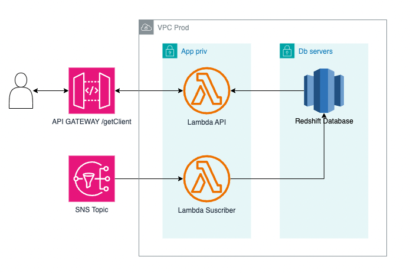
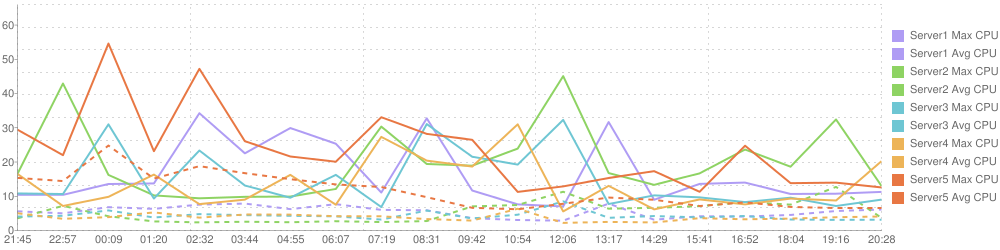

# Challenge Latam Devops


## Parte 1: Infraestructura e IaC


1. Para la infraestructura se utilizó principalmente servicios de AWS y estos se levantaron utilizando terraform con distintos módulos. Para la solución de este problema se propone utilizar como base de datos Redshift, pues precisamente esta se encuentra enfocada en el análisis de datos. Para tomar un enfoque pub/sub se propone utilizar el servicio de SNS de aws junto con Lambda para desarrollar la API. Más concretamente se desarrollaron 2 funciones lambda, una que funciona como API junto con API Gateway y que se encarga de recibir los GET solicitados por los usuarios, consultar a la BD y servir los datos solicitados, y la otra funciona como un suscriptor del tópico de SNS en donde, al publicar un mensaje en el tópico de SNS, esta función se encarga de procesar el mensaje y subir los datos a la base de datos de Redshift. La infraestructura de las funciones lambda junto con api-gateway y la asociación en la tabla de rutas se levantará automáticamente utilizando serverless, por ello sus módulos no se encuentran en terraform. En cuanto a la suscripción de la función lambda al tópico, se asume que una vez creada la función lambda, manualmente se ingresa a SNS y se crea la suscripción con el arn de la función (esto se hace así y no con terraform ya que es necesario tener el arn de la función lambda). Se asume que primero se ejecuta la creación de recursos de terraform y luego la creación de recursos con serverless.
2. Como se mencionó, gran parte de la infraestructura se levantó con terraform en varios módulos. Estos corresponden a los siguientes:
   - **main.tf**: Contiene la versión a utilizar de terraform y del proveedor de hashicorp/aws. También define las llaves de aws a utilizar para poder levantar la infraestructura. Se asume que existe un bucket terraform-latam con el archivo terraform-state.tfstate el cual contiene los estados de los recursos de terraform. Adicionalmente se asume que existe un perfil creado "latam" con el cli de AWS que contiene las llaves con los permisos necesarios para levantar toda la infra.
   - **networking.tf**: Se creó una VPC de producción en us-east-1 con 3 subnets de app privada (que utilizará la aplicación) y 3 subnets de base de datos (que utilizará la BD). Cada subnet en la region us-east-1a, us-east-1b y us-east-1c para tener una mayor disponibilidad y en caso de que alguna región falle bastaría únicamente con cambiar la subnet y el servicio vuelve a estar disponible. Para este ejercicio se utilizará únicamente la subnet de us-east1a. Se crean también los grupos de seguridad db-ingress, el cual utilizará la aplicación para poder acceder a los recursos de la BD y se crea también el grupo de seguridad db-servers que permite el ingreso únicamente por el puerto 3306 desde los recursos que contengan únicamente el sg db-ingress. Esto entrega una mayor capa de protección a los datos, pues solo se permite el acceso desde db-ingress. Por último se crea un sg "latam-challenge" que únicamente contiene una outbound rule que permite la salida hacia cualquier lado y que será utilizado por la función lambda.
   - **redshift.tf**: En este módulo se crea el cluster de redshift con las subnets de bds y con el sg de db-servers. Se tienen varias consideraciones en cuenta. La primera es que se asume que en el secrets manager de la cuenta existe un secreto "prod/redshift/credentials" con las credenciales a utilizar para el acceso al cluster. Se asume también que existe ya una llave KMS redshift que permite encriptar la base de datos y que existe un rol "AWSServiceRoleForRedshift" con la policy manejada por AWS "AmazonRedshiftServiceLinkedRolePolicy".
   - **sns.tf**: Se crea un tópico en sns llamado "customers-topic"


## Parte 2: Aplicaciones y flujo CI/CD


Para este ejercicio se asume que existe una tabla clientes en la base de datos con los campos id, nombre, apellido, rut y correo. También se asume que existe un secreto en el secrets manager de la cuenta con las credenciales y datos de conexión a la base de datos. Otra consideración a tener en cuenta es que se obviaron algunos permisos que deben incluirse en la función lambda, más concretamente los permisos para poder leer del tópico SNS. Por último, se crean custom domains para los endpoints de la api asumiendo que existe el certificado *.latam.com.


1. Para levantar la api HTTP se utilizó lambda junto con serverless. Se creó una función de lambda en python llamada get_client que simula una llamada a la base de datos para obtener un cliente específico de la tabla clientes dado su id. Por lo tanto, esta función espera que en la llamada HTTP exista un query_param llamado client_id. Si no existe el parámetro entonces entrega error 400. Si se entrega este parámetro, se realiza la conexión a la base de datos y se ejecuta un select sobre la tabla clientes para obtener el cliente dado. En caso de que ocurra algún error, se responde con error 400 y se logea dentro de lambda el error. Al utilizarse serverless, este automáticamente levanta los endpoints indicados utilizando api gateway y se utiliza también una librería de serverles para dejar los endpoints de la api como fijos utilizando custom domains, el cual crea los registros respectivos en route53.
2. Para el deploy mediante un flujo CI/CD se optó por utilizar github actions con un workflow. Este workflow se gatilla al realizar push sobre la rama master (en este caso esta parte se encuentra comentada ya que no se hará realmente el deploy) y ejecuta un ```sls create custom_domain --stage prod``` primero, y luego ejecuta un```sls deploy --stage prod``` para levantar los nuevos cambios del repositorio a lambda.
3. Adicionalmente a la función API de lambda, se creó una segunda función subscriber que se encarga de consumir el tópico de SNS creado por terraform e insertar los datos del mensaje sobre la base de datos. Como bien se mencionó en la primera parte, la suscripción al tópico SNS creado por terraform debe hacerse de manera manual pues el arn de la función no existe hasta que se ejecuta el script de serverless y este script debe ejecutarse luego de terraform. Para hacer esto se puede ejecutar el siguiente comando :
   ```
   aws sns subscribe --protocol lambda \
   --region us-east-1 \
   --topic-arn <arn del topico> \
   --notification-endpoint <arn de función lambda> \
   ```
4. Cuando un usuario quiere obtener los datos de un cliente llama al endpoint de la función hacia api gateway con /getClient. Api gateway realiza la llamada a lambda api y esta corre la query sobre redshift para obtener los datos del cliente y los retorna. En paralelo se tiene el servicio de suscripción de lambda que se encuentra suscrito al tópico de SNS y cuando un mensaje es publicado, la función es encargada de insertarlo sobre la base de datos:


   


## Parte 3: Pruebas de integración y Puntos Críticos de Calidad


Con el fin de realizar pruebas, se asume que existe un cliente en la base de datos que es de testing y tiene id 1.


1. Para agregar un flujo de testing al flujo ya existente de CI/CD se optó por levantar un servicio de test temporal igual al de producción y ejecutar las llamadas a la api hacia este servicio de prueba. Si todas las llamadas se realizan correctamente entonces se elimina este servicio de test temporal (en caso de que falle también se elimina el servicio temporal de testing) y se hace un deploy del servicio de producción. Para lograr esto, se agregan 2 stages al script de serverless, un stage "prod" y otro stage "test". El stage de prod se levanta con dominio customdomain.latam.com y el stage de test se levanta con dominio customdomain-test.latam.com. Ambos servicios levantan exactamente la misma función con los mismos grupos de seguridad y subnets para simular la prueba lo más cercano a producción. Entonces, en el workflow de github actions primero se hace un deploy del stage test, se corren las pruebas (en este caso como la prueba era únicamente de un solo endpoint, se le pega al endpoint con curl y se espera 200, pero si la aplicación crece, se recomienda crear un script encargado de realizar las pruebas más precisas como verificar que efectivamente las respuesta tiene la estructura que se espera) y si las pruebas se ejecutan con éxito, entonces se realiza un deploy del servicio de producción. Independientemente del resultado de las pruebas, el servicio de test siempre se elimina al final del workflow.
Existen varias razones por las que se escogió realizar el testing de esta forma. La primera, como bien se mencionó, al levantar prácticamente un clon de la aplicación, se tiene un servicio lo más cercano a producción y lo más cercano a la realidad. Por otra parte, dado que la base de datos se encuentra en una subnet privada solo accesible por las aplicaciones que utilicen el grupo de seguridad, si se corren pruebas desde el workflow directamente, este no podría llegar a la base de datos y entregaría timeout. Para solucionar esto se puede setear una VPN en el workflow y permitir el acceso a la base de datos desde una VPN también (crear un segundo grupo de seguridad vpn-ingress). Si se realiza eso se pueden correr pruebas hacia la base de datos sin necesidad de levantar un servicio clon. Esto nos lleva a las desventajas de realizar pruebas de esta forma, pues, al levantar un clon similar a la aplicación original, se duplica el tiempo del deploy, pues se debe primero esperar a que la aplicación de testing se encuentre lista, correr las pruebas y luego recién se levanta la aplicación de producción. Dependiendo del tamaño del servicio, esta solución puede nos siempre ser viable.
2. Para realizar pruebas sobre la aplicación siempre es recomendable crear un ambiente de QA o Staging que simule producción y que contenga todos los servicios que nos interesa probar. Por lo tanto, agregaria un workflow más a serverless, similar al de test, pero que levante el servicio en un stage de QA y que utilice una base de datos de QA, no la de producción, pues en caso de que ocurra algún error, todas las pruebas se realizan sobre un ambiente controlado y separado al de producción de tal forma que no se ve afectado la operación cotidiana. Una vez creado el ambiente QA, se propone probar primero los endpoints y que la respuestas coinciden con lo esperado, por lo menos en estructura, por ejemplo si al hacer un get_client se espera recibir una respuesta con estado 200 y con el cliente, se debe verificar que esto ocurra. También se debe probar los casos en que la aplicación o la base de datos no funcione correctamente y que las respuestas entregadas por la aplicación en estos casos no sean 200 o no tengan una estructura bien definida. El sistema debe ser capaz de manejar estos casos y no caerse por completo, si no entregar un mensaje de error de conexión o similar.Para esto se deben simular escenarios de fallo, como la pérdida de conexión con la base de datos y verificar que el sistema pueda recuperarse correctamente. Otra prueba que propongo hacer es una prueba de carga utilizando alguna herramienta como Jmeter, que permita realizar varias solicitudes simultáneas a la API para verificar que tanto la API como al BD pueden manejar todas estas conexiones en un caso de mucha demanda. En estos casos se debe medir también los tiempos de respuesta para verificar como se ve afectado todo el sistema en caso de una carga intensiva.
3. El primer punto crítico del sistema es la conexión a la base de datos. Si no se definen bien los recursos a utilizar por la base de datos, cuando haya un gran volumen de solicitudes puede que la cpu y memoria de la BD no sean suficientes y esta termine reiniciandose. En este tiempo se encolan las conexiones, las cuales, ingresan todas en simultáneo apenas vuelve a estar disponible la BD. Si el número de conexiones encoladas es mayor a la capacidad que tiene la base de datos entonces no se permitirán más conexiones y la aplicación seguramente se caiga por no poder acceder a la BD. Para resolver este problema momentáneamente se debe aumentar el número de instancias de la base de datos para que soporte más conexiones y distribuya la carga. Si se quiere evitar que ocurra esto es necesario generar pruebas de carga utilizando herramientas como Jmeter o BlazeMeter y tener un margen de al menos un 20% de uso de CPU y memoria (es decir, que la CPU/Memoria no superen el 80%). También es recomendable crear alarmas de CPU/Memoria/Conexiones que avisen de antemano que esto puede ocurrir y antes de que ocurra aumentar el número de instancias. Este corresponde a uno de los puntos críticos con respecto a la BD, pero también puede ocurrir con la API, si bien Lambda escala de manera automática por defecto y soporta bastante concurrencia, tiene algunos parámetros que se configuran de manera manual y no escalan automáticamente, como la memoria. Nuevamente, si hay un uso intensivo de la aplicación y no se define bien la cantidad de memoria, entonces se podría caer. La solución en este caso es la misma que ocurría con la base de datos, se deben correr pruebas de carga y medir cómo se comporta la memoria y si es necesario, aumentarla.
Hasta ahora solamente se discutieron puntos críticos con respecto a la performance del sistema, pero también puede ocurrir que el sistema no tenga problemas de performance por carga si no que haya un bug o error en el código. Puede ocurrir que las conexiones a la base de datos no se cierren correctamente, o que haya un bug que genere error en la aplicación porque algún dato tiene una estructura distinta, entre varios problemas que podrían ocurrir. En estos casos la aplicación puede fallar y no es necesariamente por carga. Para mitigar estos errores (es imposible evitar por completo bugs en aplicaciones grandes) se puede tener un sistema de logs y de alarmas que se gatillen cuando un error se repite varias veces. Existen varias herramientas para esto como AppOptics o en el mismo aws ElasticSearch. Estas herramientas permiten crear alarmas si existen muchos errores dentro de los logs o si hay un comportamiento anormal y por supuesto sirven también para visualizar estos errores y resolverlos lo antes posible.
Por último, otro punto crítico de la aplicación es su seguridad. Si no es necesario que un endpoint o acceso a la aplicación deba ser público, entonces se debe dejar privado. Por ejemplo la base de datos en la implementación de este problema se levantó sobre un subnet privada solamente accesible desde las aplicaciones y desde el puerto 3306. También, en caso de ser necesario, se debe implementar un sistema seguro de autenticación de usuarios. Es posible también en AWS utilizar la herramienta de WAF (web application firewall) en donde se pueden definir reglas para evitar ataques de bots o intentos de ataques. Con estos puntos se puede robustecer enormemente la seguridad del servicio.
4. Como se fue mencionando a lo largo de la pregunta anterior, para robustecer el sistema es necesario correr pruebas tanto de estrés, como de seguridad y de integración para verificar que todo funcione correctamente y que se están asignando los recursos necesarios. De todas formas, es imposible saber cómo se comportará el sistema en un futuro y el flujo que tendrá, así como también es imposible evitar bugs y errores en aplicaciones grandes. Si bien AWS ofrece políticas de autoescalamiento para mitigar estos problemas, estas no cubren todos los casos y no siempre son suficientes. Es por ello que es necesario crear un sistema de logs y de alarmas que permitan saber de antemano cuando un error ocurrirá. Alarmas de CPU, Memoria, Conexiones, Errores, entre otras, que se gatillen cuando aumentan inusualmente pueden ser muy útiles para asignar manualmente recursos al sistema en casos de mucha carga o resolver un problema antes de que escale mucho y evitar que un error se convierta en una caída.


## Parte 4: Métricas y Monitoreo


1. Entre las métricas que se pueden tener para medir la salud y rendimiento del sistema se encuentran las siguientes:
   - Número de Requests: El número de request nos puede dar una idea de que tanto está siendo solicitada la aplicación. Si existe un gran uso de CPU/Memoria y un gran número de request, es lo normal pues significa que el sistema está siendo utilizado con una gran carga, pero si hay un gran uso de CPU/Memoria y un bajo número de requests, entonces puede que exista algún error en el codigo que esta utilizando más recursos de lo necesario o la cantidad de CPU asignada no es suficiente.
   - Conexiones a BD: AWS permite medir la cantidad de conexiones a la BD lo que resulta útil para notar cuando existen errores en el código y las conexiones no son cerradas. Si una base de datos llega a su límite de conexiones entonces no permite el ingreso de conexiones nuevas evitando que la aplicación pueda conectarse y generando una potencial caída. Mantener un número bajo de conexiones es crucial para evitar problemas.
   - Error Count Rate: Lambda ofrece una métrica para contar la cantidad de eventos que fallan con respecto al total de eventos. Si esta métrica aumenta mucho es preocupante pues significa que de todas las request, varias tienen algún error.
2. Dado que se está trabajando con AWS se propone como herramienta de visualización/monitoreo Cloudwatch. Cloudwatch permite crear gráficos y dashboards con las métricas relevantes de la aplicación y de la base de datos y como ya se encuentra dentro del mismo AWS, su implementación es muy sencilla. Se propone crear 2 dashboards, uno respecto a la aplicación en lambda y otro con respecto a la base de datos. En cuanto al dashboard de lambda incluiría las métricas de uso de memoria, error rate, requests, duración y número total de concurrencias. En cuanto al dashboard de la base de datos, mediría el uso de cpu, memoria, disco, conexiones, y selects/s. Todas estas métricas nos permiten entender que tanto uso tiene el sistema y cuántos recursos está usando con respecto a este uso. Por ejemplo las requests, el número total de concurrencia y los selects/s nos indican cuánto se está usando el sistema, mientras que la cpu, memoria y disco nos entregan información de cuántos recursos se están usando. Puede ocurrir que exista un bajo número de requests y un alto porcentaje de uso de recursos por lo que sería necesario realizar alguna optimización o simplemente se asignaron muy pocos recursos a la aplicación. Estas métricas nos permiten observar esto mismo. Luego, en el caso de lambda, métricas como error rate y la duración de ejecución de la función nos puede entregar información importante de si hay algún problema con el código. Si hay muchos errores probablemente haya problemas y si la duración es muy larga, probablemente haya que optimizar el código o verificar en que se consume tanto tiempo.
3. Para implementar el uso de Cloudwatch en aws no se debe hacer nada, pues AWS automáticamente envía las métricas de sus servicios a Cloudwatch y es por esto que se escogió esta herramienta. Ahora bien, si se desea crear un dashboard como se mencionaba antes, simplemente se debe ir a la sección de dashboards de cloudwatch y seleccionar la opción de Crear Dashboard. Dentro del dashboard se pueden incluir distintos tipos de gráficos para las distintas métricas. Lo mejor es utilizar un gráfico de línea sencillo para cada una de las métricas mencionadas anteriormente. En cada gráfico se debe seleccionar el servicio y la instancia que se desea medir, en este caso la función de lambda y la base de datos de Redshift.
4. Si escalamos las solución a 50 sistemas similares, la visualización de datos no se vería tan comprometida pues bastaría con simplemente agregar los nuevos sistemas a los gráficos ya existentes y al tratarse de graficos de linea y no de datos en una lista, resulta más sencillo observar cuando alguno de los sistemas se encuentra funcionando anormalmente. Esto resulta cierto siempre y cuando se busque que todos los sistemas funcionen con una carga similar y que las solicitudes se distribuyan de la manera más uniforme posible. Un ejemplo de cómo se ven los gráficos en cloudwatch con varios servicios se encuentra a continuación:

En este ejemplo se dispone de 10 sistemas, pero en el caso de ser 50 puede resultar claramente más complejo observar el comportamiento individual y detallado de cada uno. Aun así, en conjunto no resulta tan difícil, especialmente si se desea distribuir la carga uniformemente entre todos los sistemas y observar cuales tienen mayor carga. Aquellos con mayor carga son fácilmente distinguibles en el gráfico, pues su curva se encuentra sobre la del resto. Si todavía se quiere mantener un nivel de detalle más específico sobre cada sistema, se pueden dividir en grupos de 10 y se tendrán 5 gráficos por cada métrica. Esto facilita el análisis individual y más detallado de cada sistema, pero comprometería la visualización general. Es más sencillo observar el comportamiento general de una métrica en un gráfico en donde todas las curvas se comportan similarmente a observar en 5 gráficos separados.
Una de las ventajas que nos permite tener varios sistemas, es que se dispone de un punto de comparación entre cada sistema individual y también aumentan la diversidad de casos posibles. Esto puede ser útil para observar problemas que no fueron considerados en el testing y que afectan en la performance para así solucionarlos o mitigarlos, generando un sistema cada vez más robusto.
Al disponer de 50 sistemas separados, se puede agregar una nueva métrica que corresponde a la de los unhealthy hosts. Esta métrica indica cuántos de los 50 sistemas se encuentran caídos, es decir, no reciben respuesta. Para implementar esta métrica es necesario agregar una especie de healthcheck a la aplicación que constantemente consulte si se puede acceder a ella (puede ser por un endpoint /healthcheck que simplemente espere de respuesta 200). Si muchos sistemas se empiezan a caer es porque existe un problema en el código y debe ser solucionado lo antes posible antes de que haya una caída completa.
5. Si no se aborda correctamente el problema de escalabilidad a nivel de observabilidad puede ocurrir que si bien se disponen de las métricas necesarias para poder hacer un análisis del sistema, no sea posible realizarlo pues al tener una gran cantidad de datos no ordenados o agrupados, es muy complejo encontrar patrones o comportamientos. Es por ello que siempre es recomendable agrupar los datos según algún criterio como tipo de métrica o por aplicación, así, de esta forma, al generar grupos se pueden observar más fácilmente cómo funcionan en conjunto los elementos del sistema y no cada uno individualmente. Siempre se debe tener en cuenta que a medida que un sistema escala, el nivel de detalle de visualización de cada elemento individual se hace cada vez más complejo pero no por ello se debe perder completamente el detalle de esto.